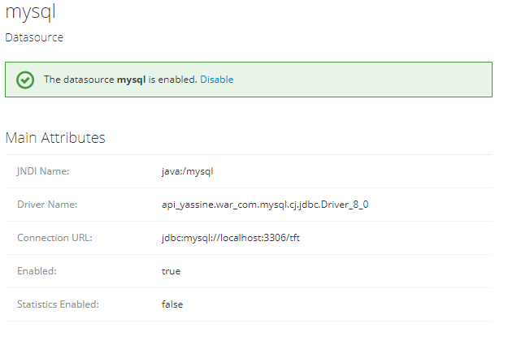

# Installation
install [mvn](https://maven.apache.org/install.html) apache packages.

install an [WAMP SERVER](https://www.wampserver.com/) to host localy the database.

Then run : 

```CLI
git clone https://github.com/BabyReggae/api_yassine.git
cd api_yassine
mvn clean install
mvn wildfly:run
```

Then its time to configure the widlfy plugin : 
Open your [http://localhost:9990/console/index.html](http://localhost:9990/console/index.html)


First : ' Configuration > Subsystems > Datasources &... > JDBC Drivers > "addDrivers" '

Then : 
' Configuration > Subsystems > Datasources &... > Datasources > "addDataSources" '


See :  
See : 

```CLI
Ctrl+C
Ctrl+C
mvn wildfly:run
```

And we're done guys.